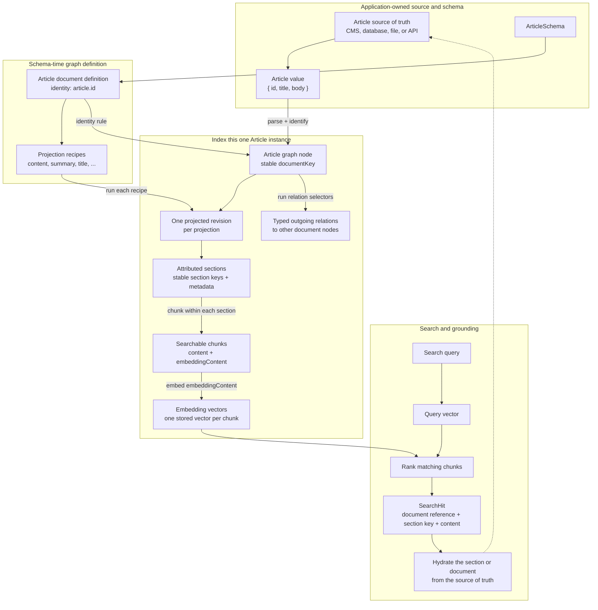
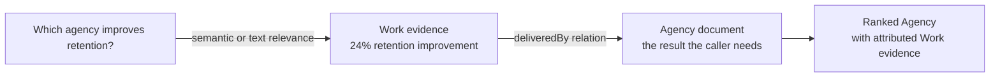

# @popcomputer/document-graph

Schema-first document graphs for Effect applications.

Define document types, searchable projections, metadata, chunking, and graph
relations once with Effect Schema. The package derives typed indexing, hybrid
search, graph retrieval, traversal, and grounding APIs from that definition.

```ts
// Run after the source Article changes.
yield* Articles.index(article)

// Run later, whenever a user searches.
const hits = yield* ArticleContent.search(
  "How do we handle enterprise authentication?",
  { limit: 10 },
)
```

The package includes PostgreSQL and in-memory storage. Applications retain
control of embedding providers, source documents, authorization, and public
response shapes.

## Features

- Effect Schema as the source of truth for documents and metadata
- Typed document, projection, relation, and retrieval handles
- Semantic, full-text, and reciprocal-rank-fused hybrid search
- Complete-revision delta indexing with embedding reuse
- Schema-defined metadata filters and graph search scopes
- Target-oriented retrieval across direct and related evidence
- Typed incoming and outgoing neighbour traversal
- Per-document custom chunking with section-level attribution
- PostgreSQL storage with no required extensions
- In-memory storage and backend conformance suites
- Typed Effect failures and safe tracing attributes

## Installation

```sh
bun add @popcomputer/document-graph effect@4.0.0-rc.109 pg
```

The package currently targets Effect `4.0.0-rc.109`. The published
`@popcomputer/web@0.3.0-rc.1` package still declares an Effect v3 peer, so its
integration needs a v4-compatible release before the two packages can be used
together. `pg` is needed when composing the included PostgreSQL adapter.

For PostgreSQL, apply
[`migrations/postgres/0001_initial.sql`](./migrations/postgres/0001_initial.sql)
with the application's migration tool. The runtime never modifies the database
schema.

## Quick start

### 1. Define a document and its searchable projection

```ts
import { Schema } from "effect"
import {
  defineDocument,
  defineDocumentGraph,
} from "@popcomputer/document-graph"

export const ArticleSchema = Schema.Struct({
  id: Schema.String.check(Schema.isUUID()),
  title: Schema.Trimmed.check(Schema.isNonEmpty()),
  body: Schema.Trimmed.check(Schema.isNonEmpty()),
})

const ArticleDocument = defineDocument(ArticleSchema, { id: "id" }).vectorise({
  id: "content",
  version: "v1",
  select: (article) => ({
    context: article.title,
    sections: [
      {
        key: "body",
        content: article.body,
      },
    ],
  }),
})

export const KnowledgeGraph = defineDocumentGraph({
  id: "knowledge-base",
  documents: { Article: ArticleDocument },
})

export const Articles = KnowledgeGraph.document("Article")
export const ArticleContent = Articles.projection("content")
```

This expression defines three separate pieces of identity:

- `defineDocument(ArticleSchema, { id: "id" })` selects the `id` field from
  `ArticleSchema` as the document's graph-node identity. It does not set the ID
  to the string `"id"`. For each parsed Article, the package validates
  `article.id` with that field's schema and combines its encoded value with the
  graph ID and document kind to derive a stable storage key.
- `id: "content"` names one searchable projection of an Article. It is the
  value used by `Articles.projection("content")` and allows the same document
  type to expose other projections such as `summary` or `title`.
- `version: "v1"` is the application-owned compatibility version of the
  `content` projection. It describes the projection policy, not an individual
  Article revision or a package release.

The document identity shorthand is equivalent to the advanced form:

```ts
const ArticleDocument = defineDocument({
  id: ArticleSchema.fields.id,
  value: ArticleSchema,
  identify: (article) => article.id,
})
```

Changing an Article's title or body updates the same graph node. Treat its `id`
as immutable: another value describes another node. If an identity must change,
index the new Article and remove the previous node with
`Articles.remove(previousId)`. Change a projection ID only when introducing or
renaming a logical searchable view; the package treats the new ID as a new
stored projection. Change its version when evolving the meaning of the same
projection. Version changes and their rollout effects are detailed in
[Versioning policy](#versioning-policy).

This is the complete graph definition. It determines the document ID type,
projection name, persistent projection version, indexed text, and search result
reference. There is no separate vector-to-document mapping.

The example also establishes an important ingestion boundary. `ArticleSchema`
should contain application-ready content, not unprocessed HTML, PDF bytes, or
layout chrome. A source adapter should first extract meaningful structure and
normalise text; `select` then turns that structure into attributed sections.
For richer documents, prefer separate sections for headings, CMS blocks, table
rows, or evidence items rather than flattening everything into one body.

`context: article.title` preserves meaning when a body fragment is embedded in
isolation. The default chunker prefixes document context and the section label
to `embeddingContent`, while `hit.content` remains the focused fragment shown
to callers. Retrieval therefore benefits from surrounding meaning without
forcing every result or grounding prompt to repeat it.

The same code is typechecked in
[`examples/quick-start.ts`](./examples/quick-start.ts).

### How one input becomes searchable

An Article does not contain many documents in this model. `Article` is a
document kind, and each parsed Article value is one document instance and one
graph node. A document definition may have several projection recipes, and
every recipe is applied independently to each instance.

A projection is not an embedding. It is a named, versioned recipe that selects
searchable structure from a document. Running that recipe produces sections;
chunking splits each section into retrieval units; the embedding provider then
creates a vector for each chunk's `embeddingContent`.



The cardinality is therefore:

```text
one document kind
  -> many document instances / graph nodes
    -> many named projections
      -> one current revision per projection
        -> many attributed sections
          -> one or more chunks
            -> one embedding vector per chunk
```

The package stores the derived retrieval records, vectors, references, and
relations. The application remains the source of truth for the complete
Article, which is why a search hit can later hydrate larger grounding material
without treating the vector index as document storage.

### 2. Compose storage and embeddings

```ts
import { Effect, Layer } from "effect"
import { Pool } from "pg"
import {
  defineEmbeddingProfile,
  EmbeddingProvider,
  type EmbeddingProviderService,
} from "@popcomputer/document-graph"
import { postgresDocumentGraph } from "@popcomputer/document-graph/postgres"

export const documentGraphLive = (
  pool: Pool,
  embeddings: EmbeddingProviderService,
) =>
  Layer.mergeAll(
    Layer.succeed(EmbeddingProvider, embeddings),
    postgresDocumentGraph({ pool }),
  )
```

`postgresDocumentGraph` provides indexing, semantic search, full-text search,
and relations. The application supplies its embedding implementation through a
small Effect service:

```ts
const embeddings: EmbeddingProviderService = {
  profile: defineEmbeddingProfile({
    id: "provider/model-name",
    version: "v1", // Application-owned compatibility revision
    dimensions: 1_536,
  }),
  embedDocuments: (requests) =>
    embeddingAdapter.embedDocuments(requests),
  embedQuery: (query) => embeddingAdapter.embedQuery(query),
}
```

Use `defineEmbeddingProfile` when constructing the service so model identity,
configuration version, and dimensions are validated. The package does not
inspect the embedding adapter, so the application must declare when its output
is safe to reuse.

The complete `{ id, version, dimensions }` tuple identifies one compatible
vector space:

- `id` is a stable, application-chosen name for the model or embedding profile,
  such as `provider/model-name`. Change it when adopting a different model
  family or introducing a separate embedding purpose.
- `version` is the application's compatibility revision for that profile. Start
  with `v1` and increment it when evolving the same logical profile in a way
  that can produce meaningfully different document vectors.
- `dimensions` is the exact number of components returned by both embedding
  operations. Provider output with another size is rejected.

Bump the profile version when changing model revisions, output dimensions,
document preprocessing, task modes, prefixes, pooling, normalisation, or any
other adapter behaviour that makes stored vectors unsafe to reuse. Do not bump
it for API keys, retries, timeouts, batching, or an SDK upgrade that preserves
embedding behaviour. Source content, projection, metadata, and chunking changes
are tracked separately and do not require an embedding profile change.

When the tuple is unchanged, indexing can reuse vectors with matching content
hashes. When any part changes, existing vectors are treated as incompatible and
each document is re-embedded the next time it is indexed. Semantic search only
compares query vectors with stored revisions using the exact current tuple.
Changing a profile therefore requires a coordinated full reindex; semantic
coverage is partial while old and new profiles coexist during the rollout.

See [`examples/postgres-storage.ts`](./examples/postgres-storage.ts) for the
typechecked composition boundary.

### 3. Index when source content changes

```ts
const indexed = yield* Articles.index(article).pipe(
  Effect.provide(documentGraphLive(pool, embeddings)),
)
```

`Articles.index(article)` indexes every Article projection and replaces its
complete outgoing relation set. Call it when an Article is created or updated:
for example from the content write action, a CMS webhook, or a background sync.
Indexing is idempotent and delta-aware, so unchanged revisions do not create
new embeddings.

Indexing is also document-scoped. This call loads and reconciles only the
projection revisions and outgoing relations owned by the supplied Article. It
does not scan or update any other Article. Within each projection, vectors are
reused by `contentHash` whenever the embedding text and embedding profile are
unchanged:

| Change to this Article | Work performed for this Article |
|---|---|
| No effective projection or relation change | Each projection returns `Unchanged` with no embedding or projection replacement; the relation set is reconciled idempotently |
| Metadata, visibility, or citation only | Updates the stored revision and reuses existing vectors |
| One section's embedding text changes | Embeds only its new content hashes and reuses the others |
| A section or chunk is removed | Deletes stale records without embedding unchanged content |
| Document context changes, such as the title with the default chunker | Re-embeds chunks whose `embeddingContent` includes that context |
| Embedding profile changes | Re-embeds every chunk in this Article; the application must index the other Articles separately for a corpus-wide migration |

For focused background work, projection handles expose the lower-level
operations without updating graph relations:

```ts
const revision = yield* ArticleContent.project(article)
const indexed = yield* ArticleContent.index(article)
```

`project(article)` performs only deterministic parsing, projection, chunking,
and identity derivation; it does not call an embedding provider or storage.
`ArticleContent.index(article)` delta-indexes only the `content` projection for
this Article. `Articles.index(article)` is the normal complete operation because
it keeps every Article projection and the Article's outgoing relations in sync.

A multi-document reindex is application-orchestrated and is needed after a
policy change affecting existing stored documents, such as an embedding
profile, projection, chunker, or relation version change. The package still
processes one supplied document at a time, allowing the application to iterate
over only the affected document kinds, queue work, retry failures, and
rate-limit the migration using its existing background-work infrastructure.

### 4. Search the current index

```ts
const hits = yield* ArticleContent.search("authentication", {
  limit: 10,
}).pipe(Effect.provide(documentGraphLive(pool, embeddings)))
```

`ArticleContent.search(...)` reads the indexed projection and uses hybrid
semantic and text retrieval by default. It does not index the Article first.
Once source changes have been indexed, this operation can run for every search
request without re-embedding content.

## Web integrations

Graph operations remain ordinary Effects, so applications can place their HTTP
boundary around indexing and search without a transport-specific wrapper. The
published `@popcomputer/web@0.3.0-rc.1` package still requires Effect v3, so the
former Web action example is intentionally not included in this v4 release. It
can return once `@popcomputer/web` publishes an Effect v4-compatible version.

## Design model

The package is built around five concepts:

| Concept | Responsibility |
|---|---|
| Document | A typed graph node with stable identity |
| Projection | A versioned searchable view of one document type |
| Section | The smallest attribution and metadata boundary |
| Relation | A typed, versioned directed edge between document types |
| Retrieval | An application-named policy for ranking target nodes from evidence |

This separation keeps application intent compact while retaining explicit
persistent identity and provenance.

### Why the schema owns the graph

Document definitions are the only mapping between application values, vector
records, and graph nodes. From the graph definition, TypeScript infers:

- valid document IDs and document kinds;
- valid projection and relation names;
- projection metadata fields and filter values;
- legal retrieval routes and target kinds;
- result reference types;
- Effect service requirements.

For composite identity, use the advanced document form:

```ts
const LocalizedArticleId = Schema.Struct({
  site: Schema.Trimmed.check(Schema.isNonEmpty()),
  slug: Schema.Trimmed.check(Schema.isNonEmpty()),
})

const LocalizedArticle = Schema.Struct({
  site: Schema.Trimmed.check(Schema.isNonEmpty()),
  slug: Schema.Trimmed.check(Schema.isNonEmpty()),
  title: Schema.Trimmed.check(Schema.isNonEmpty()),
})

const LocalizedArticleDocument = defineDocument({
  id: LocalizedArticleId,
  value: LocalizedArticle,
  identify: (article) => ({
    site: article.site,
    slug: article.slug,
  }),
})
```

### Versioning policy

IDs answer “which policy is this?” Versions answer “which semantics does the
current form of that policy implement?” Keep an ID stable while evolving the
same logical policy, and increment its version when stored output produced by
the old implementation should no longer be treated as current. The package
does not infer versions from source code.

| Version supplied by the application | What it versions | When to change it | What happens when it changes |
|---|---|---|---|
| Projection `version` in `vectorise(...)` | The `select` mapping, section and attribution contract, metadata meaning, and semantic purpose of one projection ID | Change when the projection starts selecting or interpreting document material differently. Do not change for ordinary document edits. | Revision hashes change. Reindex every document owning the projection; the same projection storage is replaced and unchanged content embeddings can be reused. Search only accepts the registered projection version, so stale documents must not remain during rollout. |
| Chunker `version` in `defineChunker(...)` | The implementation and semantics of one reusable chunker ID | Change when splitting logic changes for the same configuration. Do not change merely because a schema-defined config value changes; encoded configuration already participates in revision identity. | Every projection using the chunker receives a new revision on reindex. Chunk positions are recomputed, stale chunks are deleted, and embeddings are reused only where embedding content remains identical. |
| Relation `version` in `relation(...)` | The persisted meaning, endpoints, and selector policy of one directed relation ID | Change when the relationship or the code selecting its targets changes meaning. Do not change when only one source document's relation values change. | Reindex all source documents for that relation to replace their complete outgoing edge sets. Traversal only reads the registered relation version, so old edges do not contribute while migration is incomplete. |
| Embedding profile `version` in `defineEmbeddingProfile(...)` | The vector-compatibility revision of one embedding profile ID | Change when the same text can produce vectors that are unsafe to reuse because of model, dimensions, preprocessing, task mode, prefix, pooling, normalisation, or similar changes. | Existing vectors are incompatible and cannot be reused. Re-embed the complete corpus; semantic search only includes stored revisions matching the current `{ id, version, dimensions }` tuple. |

Versions are opaque stable strings; the package does not interpret semantic
versioning. `v1`, `v2`, and so on are sufficient. Change the version owned by
the policy that changed rather than incrementing every version together:

- source content or metadata values require indexing, not a version bump;
- a projection mapping change requires a projection version bump;
- a chunking algorithm change requires a chunker version bump;
- a relationship policy change requires a relation version bump;
- an incompatible vector-space change requires an embedding profile version
  bump, or a new profile ID when adopting a distinct model family or purpose.

Treat version changes as data migrations. The included stores retain one
current revision per document and projection rather than parallel projection
versions. Coordinate each change with the affected reindex. When a projection
or relation ID is removed or renamed, reindex the active definitions and run
`KnowledgeGraph.reconcileIndex()` to prune storage belonging to definitions
that are no longer registered.

## Search

### Hybrid search

Projection search defaults to hybrid retrieval when text search is enabled:

```ts
const hits = yield* WorkEvidence.search(query, { limit: 10 })
```

The semantic and text branches run concurrently. Their ranked lists are
combined by deterministic weighted reciprocal-rank fusion, so unrelated score
scales are never added together.

Hybrid search is a ranked union, not a requirement that every result match both
channels. A conceptually relevant semantic result can rank without containing
the query terms, and an exact lexical result can rank without a strong vector
score. When a condition is mandatory, express it as schema-validated metadata
or graph scope before candidate limiting, or select text-only search when a
lexical match is itself the requirement.

Use an explicit strategy when the query or available infrastructure requires
one channel:

```ts
const lexical = yield* WorkEvidence.search(query, {
  strategy: "text",
  limit: 10,
})

const semantic = yield* WorkEvidence.search(query, {
  strategy: "semantic",
  limit: 10,
})
```

The Effect requirements narrow with the strategy. Text search does not require
an embedding provider; semantic search does not require a text store.

Hybrid weighting and candidate budgets remain available as server-owned
policy:

```ts
const hits = yield* WorkEvidence.search(query, {
  strategy: {
    mode: "hybrid",
    weights: { semantic: 1, text: 2 },
    rankConstant: 60,
  },
  candidates: { semantic: 60, text: 40 },
  limit: 12,
})
```

Invalid runtime options fail as `InvalidSearchQuery` through the Effect error
channel. Do not pass unconstrained client-authored tuning values directly into
search.

### Metadata filters

Projection metadata is declared with Effect Schema:

```ts
const EvidenceMetadata = Schema.Struct({
  kind: Schema.Literals(["challenge", "approach", "outcome"]),
})
```

Object shorthand creates an implicit `AND`:

```ts
const outcomes = yield* WorkEvidence.search(query, {
  where: { kind: "outcome" },
  limit: 10,
})
```

The inferred builder supports Boolean composition:

```ts
const evidence = yield* WorkEvidence.search(query, {
  where: (filter) =>
    filter.any(
      filter.eq("kind", "challenge"),
      filter.eq("kind", "outcome"),
    ),
  limit: 10,
})
```

Unknown fields and invalid literal values are compile-time errors. Persisted
metadata is parsed again before it reaches application code. Filter expressions
are bounded to 100 leaves and depth 8.

### Graph-wide search

When the relevant document type is unknown, search every registered projection:

```ts
const allHits = yield* SiteGraph.search("national retail launch", {
  limit: 20,
})

const workHits = yield* SiteGraph.search("national retail launch", {
  include: ["Work"],
  includeProjections: ["work-evidence"],
  limit: 20,
})
```

Graph-wide search is currently semantic. Document and projection scopes are
schema-checked and applied before candidate limiting, so excluded records do
not consume candidate slots.

## Graph retrieval

Search returns chunks. Graph retrieval ranks a target document kind using one
or more application-defined evidence routes.

### Why similarity alone is sometimes the wrong query

A graph is unnecessary when the caller only needs the passages most similar to
a query. `WorkEvidence.search(query)` already handles that case.

A graph becomes important when the document containing the best evidence is
not the document the caller needs returned. Consider this query:

> Which agency has proved it can improve customer retention?

An Agency profile may only say “product and service design”. A related Work
document may contain the much stronger evidence: “The redesigned membership
journey increased twelve-month retention by 24%.” Searching only Agency
profiles can miss the Agency; searching every vector can find the Work but
returns the wrong entity. Vector similarity also cannot prove which Agency
delivered that Work.

```ts
const directAgencyHits = yield* AgencyProfile.search(query)
const relevantWorkHits = yield* WorkEvidence.search(query)
const rankedAgencies = yield* FindAgencies.search(query)
```

The first search only sees Agency profile text. The second can find the decisive
case study but returns Work hits. The named graph retrieval searches both
routes, follows `deliveredBy` from matching Work, and returns Agency targets
with the supporting chunks attached.



The two responsibilities stay deliberately separate:

- search ranks text that is relevant to the query;
- the graph follows an application-owned fact from that evidence to its target;
- retrieval fuses contributions from direct and related evidence by target;
- the result retains the source chunks that explain why the target ranked.

The same shape appears in many domains:

| Caller wants | Relevant text may live on | Authoritative relationship |
|---|---|---|
| An Agency | Case studies and Work outcomes | `Work -> deliveredBy -> Agency` |
| An expert | Articles, talks, and project contributions | `Evidence -> authoredBy -> Person` |
| A runbook | Incidents describing matching symptoms | `Incident -> mitigatedBy -> Runbook` |
| A governing policy | A matching clause or procedure | `Section -> belongsTo -> Policy` |
| A compatible product | Requirements and verified integrations | `Integration -> supportedBy -> Product` |

These queries could be implemented with bespoke searches followed by manual
joins. That is still a graph query, but with its route, target type, ranking,
and evidence handling scattered through application code. A named retrieval
policy keeps those decisions typed and reusable.

### Define a target-oriented retrieval policy

The complete example graph defines `Agency`, `Work`, and a `deliveredBy`
relation. It then compiles a reusable Agency retrieval policy:

```ts
export const FindAgencies = SiteGraph.retrieval({
  target: "Agency",
  routes: [
    AgencyProfile,
    WorkEvidence.through("deliveredBy", {
      weight: 2,
      neighboursPerSource: 5,
    }),
  ],
  maximumEvidencePerTarget: 3,
})

const agencies = yield* FindAgencies.search(
  "We need to improve customer retention",
  { limit: 6 },
)
```

This policy means:

- an Agency profile directly supports its own Agency;
- Work evidence supports Agencies reached through `deliveredBy`;
- related Work evidence has twice the route weight;
- every ranked Agency retains bounded evidence explaining its position.

The semantic index is responsible for finding relevant evidence; the graph is
responsible for facts such as which Agency delivered the Work. Keeping those
jobs separate avoids asking vector similarity to infer an exact relationship.
The final Agency result still carries the source evidence that caused it to
rank, so applications can explain and hydrate the result rather than returning
an opaque entity score.

`FindAgencies` belongs to the application, not the package. Other applications
can define `FindProducts`, `FindExperts`, or `FindArticles` from their own graph.
Illegal relation names, source kinds, and target kinds fail during authoring.

The full graph is typechecked in
[`examples/site-graph.ts`](./examples/site-graph.ts).

### Neighbour traversal

Relations also work without search:

```ts
const agencies = yield* WorkNode.neighbours(work.id, {
  via: "deliveredBy",
  limit: 25,
})

const work = yield* AgencyNode.neighbours(agency.id, {
  via: "deliveredBy",
  direction: "incoming",
  limit: 25,
})
```

Relations are stored in their declared direction and may be read in reverse.
Traversal returns typed document references; loading and authorizing source
documents remains an application responsibility. Limits default to 100 and are
bounded to 1,000.

## Sections, metadata, and chunking

A section is the smallest attribution boundary. Every derived chunk belongs to
exactly one section and receives that section's validated metadata unchanged.
When provenance, visibility, trust, or citation changes, emit another section.

```ts
select: (work) => ({
  context: work.title,
  sections: work.evidence.map((evidence) => ({
    key: evidence.id,
    label: evidence.kind,
    content: evidence.text,
    metadata: {
      kind: evidence.kind,
    },
  })),
})
```

Here each authored evidence item becomes a semantic and attribution boundary.
The default chunker processes those sections independently and adds the Work
title and evidence label to the text used for embedding. The stored retrieval
content remains the precise evidence fragment. This preserves enough context
to disambiguate a small chunk without merging unrelated source material.

This rule also prevents chunks from combining content with different
authorization or citation requirements. Reading and chunking therefore
collaborate through a typed intermediate structure: the source adapter retains
meaningful document boundaries, the projection emits them as sections and
metadata, and the chunker only decides how to split within each section.

Source locations are application-owned metadata because web anchors, PDF
pages, CMS blocks, and timestamps use different addressing models:

```ts
const Citation = Schema.Union([
  Schema.Struct({
    _tag: Schema.Literal("web"),
    url: Schema.String,
    anchor: Schema.optional(Schema.String),
  }),
  Schema.Struct({
    _tag: Schema.Literal("pdf"),
    assetId: Schema.String,
    page: Schema.Number.pipe(
      Schema.check(Schema.isInt()),
      Schema.check(Schema.isGreaterThan(0)),
    ),
  }),
])
```

The default section-aware chunker uses a maximum of 1,800 characters. Override
it per projection when needed:

```ts
chunking: sectionChunking({ maximumCharacters: 3_000 })
```

Custom chunkers are reusable, schema-configured code values:

```ts
const fixedWindowChunking = defineChunker({
  id: "fixed-window",
  version: "v1",
  config: Schema.Struct({
    maximumCharacters: ChunkMaximumCharactersSchema,
  }),
  maximumCharacters: (config) => config.maximumCharacters,
  chunk: ({ section, config }) => {
    const fragments = []

    for (
      let offset = 0;
      offset < section.content.length;
      offset += config.maximumCharacters
    ) {
      const content = section.content
        .slice(offset, offset + config.maximumCharacters)
        .trim()

      if (content.length > 0) {
        fragments.push({ content })
      }
    }

    return fragments
  },
})
```

The fixed-window implementation demonstrates the smallest custom chunker
contract, not a universally suitable splitting policy. Sentence-, paragraph-,
heading-, or format-aware chunkers can preserve more natural semantic
boundaries when the source structure supports them.

Chunkers run independently for each section. They may repeat document context
in `embeddingContent` but cannot access neighbouring section content. This lets
an application add the context required to understand a fragment without
crossing its attribution boundary. Increment the chunker version when its
semantics change.

## Delta indexing

Indexing uses four deterministic identities:

| Identity | Meaning |
|---|---|
| `documentKey` | Stable graph-node identity |
| `chunkId` | Stable projection, section, and part identity |
| `contentHash` | Exact text sent to the embedding provider |
| `revisionHash` | Complete projection revision, including metadata and policy |

On re-index, the package:

- reuses vectors whose content hash and embedding profile are unchanged;
- updates metadata without requesting another embedding;
- embeds changed or new content;
- deletes stale chunk IDs and outgoing edges;
- reports an unchanged revision only when the stored inventory is complete.

These identities separate expensive semantic work from cheaper record updates.
A visibility, citation, or other metadata-only change updates `revisionHash`
but retains the same `contentHash`, allowing the stored vector to be reused.
With the default chunker, changing a document title, section label, or fragment
changes `embeddingContent` and correctly requests a new vector. Only new content
hashes are embedded rather than rebuilding the complete document
indiscriminately.

`EmbeddingProvider.embedDocuments` receives the unique missing content for one
projection revision as a batch. The provider adapter may split that work into
token-aware sub-batches and own rate limiting, retry, and backpressure policy.
Before storage is replaced, the core verifies that every requested content hash
has exactly one valid vector with the declared dimensions; partial or malformed
provider output fails the replacement. Corpus-level queues and worker
concurrency remain application-owned so ingestion can match the deployment's
actual provider limits.

Each projection replacement and each outgoing relation replacement is atomic
and idempotent. With pooled PostgreSQL, a document containing several
projections commits those steps independently. Retry a failed document index to
convergence.

Applications that require one PostgreSQL transaction across all projections
and relations may provide an active transaction:

```ts
const AtomicGraphLive = Layer.mergeAll(
  Layer.succeed(EmbeddingProvider, embeddings),
  postgresDocumentGraph({ transaction: client }),
)
```

The adapter uses savepoints and never commits the caller's transaction. This
mode can hold the transaction open while missing embeddings are requested, so
pooled operation remains the normal choice. See
[`ADR 0001`](./docs/decisions/0001-graph-index-atomicity-and-storage-ownership.md)
for the complete contract.

## Storage and Effect composition

The graph definition is independent of infrastructure. A storage Layer provides
only the services required by each operation.

For tests and local tools:

```ts
import { Layer } from "effect"
import { inMemoryDocumentGraph } from "@popcomputer/document-graph/in-memory"

const TestGraphLive = Layer.mergeAll(
  Layer.succeed(EmbeddingProvider, embeddings),
  inMemoryDocumentGraph(),
)
```

Every in-memory Layer owns isolated state. It implements the same replacement,
filtering, vector-reuse, relation, and optimistic-concurrency contracts as a
production adapter, but it is neither durable nor a performance simulator.

Embedding providers remain separate from storage. A model change does not
require a PostgreSQL adapter change, and a storage change does not alter source
projection code.

## Grounding

Search hits carry compact, attributable retrieval content:

```ts
hit.reference
hit.projection
hit.sectionKey
hit.content
hit.metadata
```

An application-owned `GroundingHydrator` can load a complete section or source
document after ranking:

```ts
const GroundingLive = Layer.succeed(GroundingHydrator, {
  hydrate: ({ hit, level }) =>
    SourceContent.load(hit.reference, { level }).pipe(
      Effect.map((source) => ({
        content: source.content,
        metadata: source.metadata,
      })),
    ),
})

const grounding = yield* Effect.forEach(hits, (hit) =>
  hydrateGrounding(hit, { level: "section" }),
)
```

The hydrator owns source access, authorization, and format-specific locations.
The package retains the verified document reference and section key so the
hydrator cannot reattribute returned material.

Retrieval and grounding have different size requirements. A compact chunk is
useful for locating and ranking one precise piece of evidence; the model may
need the complete section or document to answer reliably. Hydrating only after
ranking preserves precise search while allowing the application to assemble
larger, authorized grounding material without making every indexed vector or
candidate unnecessarily broad.

### Evaluate policy changes in the application

No chunk size, embedding model, hybrid weight, or candidate budget is optimal
for every corpus. Keep a representative query set with expected document and
section matches, and evaluate retrieval separately from the quality of any
generated answer. This distinguishes a search failure from a grounding or
generation failure.

The graph manifest and explicit policy versions make experiments reproducible.
Change one policy at a time, record the manifest used for an evaluation run,
and test both conceptual queries and exact terminology. The package provides
deterministic retrieval mechanics; corpus-specific relevance remains an
application-owned measurement problem.

## Failures and observability

Search exposes a small public error union:

- `InvalidSearchQuery` for invalid caller input or runtime options;
- `DocumentGraphUnavailable` for unavailable or invalid external capabilities.

Indexing retains actionable domain failures such as invalid projection output
and `ProjectionIndexConflict`. Expected failures remain in the Effect error
channel.

Public I/O operations create package-owned `document_graph` spans containing
safe policy attributes such as graph, document kind, projection, strategy, and
limits. Queries, document IDs, content, metadata, vectors, and provider causes
are never attached.

Use `toDocumentGraphErrorTelemetry(error)` before recording a
`DocumentGraphUnavailable`; its internal cause is retained for error handling
but excluded from the returned telemetry record.

## PostgreSQL

```ts
import { Pool } from "pg"
import { postgresDocumentGraph } from "@popcomputer/document-graph/postgres"

const pool = new Pool({ connectionString: process.env.DATABASE_URL })
const StorageLive = postgresDocumentGraph({ pool })
```

The adapter uses the SQL namespace created by the included migration. Supply a
`schema` option when the application owns a different namespace.

The included PostgreSQL implementation:

- stores embeddings as `double precision[]`;
- performs exact cosine similarity after graph, projection, metadata, and
  embedding-profile filters;
- uses PostgreSQL full-text search for lexical candidates;
- applies scope before candidate limits;
- protects complete revision replacement with transactions, advisory locks,
  and optimistic tokens;
- stores directed relations in the same schema;
- requires no PostgreSQL extension.

Exact vector scans provide a predictable zero-configuration baseline for
moderate corpora. Measure representative query latency before selecting an
approximate vector adapter for larger datasets.

## Adapter authors

Low-level contracts are isolated behind the adapter entry point:

```ts
import {
  makeDocumentGraphStorage,
  planOutgoingGraphRelationReplacement,
  planProjectedRevisionReplacement,
  type ProjectionIndexStoreService,
  type ProjectionSearchStoreService,
} from "@popcomputer/document-graph/adapter"
```

Applications normally import only from `@popcomputer/document-graph`. Adapter
authors provide one storage object and expose its capabilities through
`makeDocumentGraphStorage`.

Package-owned planners validate complete revision and relation replacements,
resolve reusable embeddings, and derive exact upsert and deletion identities.
Adapters remain responsible for persistence mechanics, atomicity, row parsing,
scope-before-limit, descending scores, and deterministic ordering.

Run the conformance suite through the same services used in production:

```ts
import { Effect } from "effect"
import { verifyDocumentGraphStorageConformance } from
  "@popcomputer/document-graph/testing"

const report = await Effect.runPromise(
  verifyDocumentGraphStorageConformance().pipe(
    Effect.provide(MyDocumentGraphStorage),
  ),
)
```

The suite covers complete replacement, snapshot inventories, vector reuse,
optimistic conflicts, invalid-write atomicity, stale deletion, graph pruning,
bidirectional traversal, bounded ordering, scope-before-limit, score ordering,
candidate uniqueness, stable ties, and repeatability. Run it against an
isolated database or disposable schema.

## Current boundaries

- Graph-wide search is semantic; projection search supports semantic, text,
  and hybrid strategies.
- PostgreSQL vector search is exact and does not include an ANN index.
- Graph retrieval composes direct and one-relation routes. Neighbour traversal
  is available, but there is no universal multi-hop path-search API.
- Fuzzy typo-tolerant retrieval is not currently included.
- Sections, rather than universal source spans, are the attribution boundary.
- Source hydration, application authorization, and public response shaping
  remain application responsibilities.
- Projection, relation, and chunker policy versions are explicit rather than
  inferred from code changes.
- The in-memory adapter is a behavioural implementation, not a load-testing
  substitute.

These boundaries keep the package API stable across providers and storage
engines without obscuring application-owned policy.

## Package entry points

| Entry point | Intended use |
|---|---|
| `@popcomputer/document-graph` | Document schemas and application operations |
| `@popcomputer/document-graph/postgres` | PostgreSQL composition roots |
| `@popcomputer/document-graph/in-memory` | Tests and local tools |
| `@popcomputer/document-graph/adapter` | Storage adapter implementations |
| `@popcomputer/document-graph/testing` | Adapter conformance tests |

## Development

```sh
bun install
bun run verify
```

`bun run verify` runs strict TypeScript checks, type-level API tests,
behavioural tests, a production build, and Node ESM entry-point checks. The
PostgreSQL integration suite runs when both
`RUN_DOCUMENT_GRAPH_POSTGRES_TESTS=true` and `TEST_DATABASE_URL` are set.

## License

MIT
