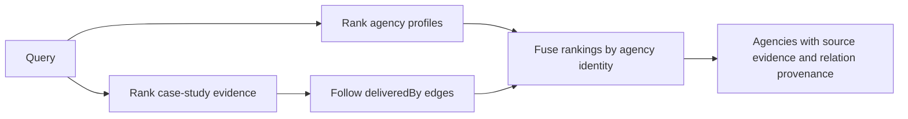

# Agency retrieval performance experiments

7 September 2026. Historical experiments against the pre-optimization 0.4.0
package. The implementation and current measurements are recorded in
[production results](./agency-retrieval-production-2026-09-07.md).

The historical runner rewrites that earlier package's SQL. Set
`BENCHMARK_BASELINE_PACKAGE` to its unpacked directory when reproducing these
experiments; the current production runner exercises the current public API
without SQL rewriting.

## The graph is the retrieval model

The fixture models the requested use case: **1,000 agency documents and 9,000
case-study documents**, connected by 9,270 `deliveredBy` edges. An agency may
be relevant because of its own profile, its case studies, or both. Some case
studies belong to multiple agencies; 90 have three owners, exercising the
two-neighbour bound used by this retrieval plan.



The benchmark invokes the public `graph.retrieval(...).search(...)` workflow
with both routes. Optimisations change storage execution through its existing
connection seam. The package still validates references, expands graph
relations, fuses rankings, and retains source evidence.

This is materially different from the earlier flat 10,000-vector benchmark:
it includes the graph retrieval workflow and has a different synthetic corpus.
Do not multiply its speedups by the earlier benchmark's results.

## Measurements

PostgreSQL 17.8 on local Apple Silicon; Node.js 22.22.2; one 1,024-dimensional
chunk per document. One warmup and five measured runs per variant, with
alternating variant order. The table shows median **retrieval wall time**,
including database calls, result decoding, graph expansion, and rank fusion.
Embeddings are deterministic fixture vectors; no embedding API or production
network latency is included. All variants use one explicitly serialized
database connection and the same augmented fixture tables.

Candidate budgets are 50 per channel per route, with ten final agencies and
at most three evidence items per agency. Hybrid retrieval runs semantic and
lexical ranking on both document types.

| Experiment | Semantic | Lexical | Hybrid | SQL statements: semantic / lexical / hybrid |
| --- | ---: | ---: | ---: | --- |
| Current production queries | 1,083.3 ms | 26.8 ms | 1,111.4 ms | 52 / 52 / 104 |
| Inline the scoped CTE | 1,064.7 ms | 31.8 ms | 1,100.3 ms | 52 / 52 / 104 |
| Calculate query-vector norm once | 1,018.7 ms | — | 1,021.4 ms | 52 / — / 104 |
| Batch graph relation reads | 1,097.5 ms | 19.3 ms | 1,135.4 ms | 3 / 3 / 5 |
| Cache stored-vector norms, calculate query norm once | 918.2 ms | — | 900.3 ms | 52 / — / 104 |
| Cache field-level text ranking vectors | — | 22.4 ms | 1,101.7 ms | — / 52 / 104 |
| Combine norms, cached text, and batched relations | 893.0 ms | 15.5 ms | 867.9 ms | 3 / 3 / 5 |
| pgvector exact cosine scoring | 90.6 ms | — | 116.4 ms | 52 / — / 104 |
| pgvector exact + cached text + batched relations | **74.9 ms** | — | **90.0 ms** | **3 / — / 5** |

The combined SQL-only experiment improves hybrid retrieval by **1.28×** and
lexical retrieval by **1.73×**. The combined native-scoring experiment improves
semantic retrieval by **14.46×** and hybrid retrieval by **12.35×**.

An earlier run without the extra native-vector column independently measured
hybrid retrieval at 1,092.7 ms before and 853.9 ms after the combined SQL-only
changes. Small differences between repeated runs are expected; the large
native-scoring improvement is the meaningful result.

Detailed samples are in
[`agency-retrieval-2026-09-07.json`](./agency-retrieval-2026-09-07.json).

## What the experiments establish

**Batched topology reads remove the graph query fan-out.** Current hybrid
retrieval makes four ranking queries, then one relation query for each of 100
distinct case studies. The prototype performs one bounded `LATERAL` relation
query for the entire source population, preserving each source's independent
neighbour limit, direction, relation version, ordering, and missing-edge
result. The result is five statements. Semantic and lexical retrieval each
drop from 52 to three.

Batching alone is not a demonstrated semantic/hybrid latency improvement on
this local SQL scorer: its cost is dominated by the exhaustive vector scan,
and measured differences fluctuate around that cost. It does improve lexical
retrieval here. Once native scoring removes the vector bottleneck, the
combined graph/text improvements reduce hybrid time from 116.4 to 90.0 ms.
Remote round-trip savings are plausible but were not measured.

**The array scorer repeatedly performs avoidable arithmetic.** Each eligible
chunk recalculates the query norm. Hoisting it saves work without changing
the result on the fixture. Persisting each stored vector's norm avoids a
second repeated aggregate. This prototype computes the query norm in
JavaScript; a production change must preserve the adapter's numeric failure
contract, including overflow and zero vectors. Cached stored norms also need
to be maintained atomically with their vectors.

**Text ranking has reusable intermediate values.** The current query uses a
stored full-text vector to find matches, then calls `to_tsvector` again for
each context, label, and content field while ranking. The prototype stores
those three English field vectors independently, keeping the existing
per-field weights and rank calculation. Its lexical gain is useful but its
hybrid contribution is small while vector scoring dominates. No write-cost
or steady-state storage trade-off has been established. The measured
ALTER/UPDATE sizes include dead tuples and must not be presented as storage
overhead estimates.

**Native exact scoring is the largest measured opportunity.** pgvector
0.8.6, source commit `8ee86c96f0fd72390f890aa8a336fda6d3ab4c6c`, was compiled
in a temporary directory. Only its vector type and scalar functions were
loaded into the disposable schema. No approximate index was built. The
existing graph/projection filters and candidate limits still surround the
scorer, and both agency and case-study routes remain active. pgvector's
implementation uses an auto-vectorized native loop for cosine similarity.
[Implementation](https://github.com/pgvector/pgvector/blob/v0.8.6/src/vector.c)

All non-native variants passed deep equality against the current public
retrieval result, including scores, target order, source chunks, source ranks,
signals, and provenance. Native variants retained all ten agencies in order
and the same source evidence/ranks/signals apart from scores. Their raw
similarity scores are **not bit-identical**: pgvector stores float32 vectors,
whereas the current adapter stores float64 arrays. This fixture does not prove
equivalence around near ties or thresholds, or relevance on real embeddings.
An optional pgvector adapter needs its own numeric and dimension contract.
[Vector representation and exact search](https://github.com/pgvector/pgvector)

**Inlining is not a blanket improvement.** It produced little semantic or
hybrid benefit and worsened lexical retrieval. Keep materialisation decisions
local to measured queries. PostgreSQL documents that inlining can cause
repeated evaluation of expensive expressions.
[CTE evaluation](https://www.postgresql.org/docs/17/queries-with.html)

## A graph-specific correctness check

The benchmark also asks whether agency-profile candidates could safely gate
case-study discovery. They cannot on this fixture:

| Retrieval mode | Agencies shortlisted by the direct profile route | Top-ten agencies excluded by using that shortlist as a gate |
| --- | ---: | --- |
| Semantic | 50 | 40, 710, 750, 79 — **4 of 10** |
| Lexical | 27 | 500, 240, 700, 210, 70 — **5 of 10** |
| Hybrid | 50 | 520, 40, 710, 910 — **4 of 10** |

Those agencies are discovered through case studies. This is why both routes
must remain independently eligible. An explicit graph constraint, such as a
known client or collection, can define a narrower population; a weak agency
profile match cannot silently become that constraint.

The check measures exclusion from the current candidate-budgeted retrieval,
not relevance against human labels or exhaustive agency-level ground truth.

## GitHub libraries worth studying

| Library | Relevant design | Application to this package |
| --- | --- | --- |
| [TypeGraph — nicia-ai/typegraph](https://github.com/nicia-ai/typegraph) | TypeScript graph modelling and typed traversals over PostgreSQL/SQLite; fluent queries compile into SQL. | Closest query-packaging reference. Study how one bounded graph query becomes one database statement. Preserve this package's document projections, publication guarantees, and evidence model. [Query compilation](https://typegraph.dev/performance/overview/) |
| [DataStax graph-retriever](https://github.com/datastax/graph-rag) | Vector retrieval combined with relationship traversal, with separate strategy and store interfaces. | Useful vocabulary for explicit seeds, traversal depth, expansion budgets, and relevance/diversity policies. It traverses metadata relationships; our canonical typed document edges remain authoritative. [Strategies](https://datastax.github.io/graph-rag/reference/graph_retriever/strategies/) |
| [Neo4j GraphRAG](https://github.com/neo4j/neo4j-graphrag-python) | Vector/Cypher and hybrid/Cypher retrievers join similarity matches to graph context. | Study how retrieval queries return related evidence with the matched target. This suggests PostgreSQL query composition; it does not require adopting Neo4j. [Concrete retriever example](https://github.com/neo4j/neo4j-graphrag-python/blob/main/examples/retrieve/vector_cypher_retriever.py) |
| [LlamaIndex](https://github.com/run-llama/llama_index) | Recursive retrievers follow linked retrieval nodes; auto-merging promotes child context to parent context. | Useful for deeper document hierarchies and evidence consolidation. Agency discovery needs explicit cross-document relations; auto-merging chunks alone does not supply that model. [Auto-merging implementation](https://github.com/run-llama/llama_index/blob/main/llama-index-core/llama_index/core/retrievers/auto_merging_retriever.py), [recursive retriever](https://github.com/run-llama/llama_index/blob/main/llama-index-core/llama_index/core/retrievers/recursive_retriever.py) |
| [pgvector](https://github.com/pgvector/pgvector) | Native PostgreSQL vector scoring, with both exact and approximate search options. | The measured optional scoring backend. Keep graph routes, eligibility, ranking fusion, and provenance above it. No ANN index is needed for the improvement measured here. |

These are design references, not a comparative library benchmark. Only
pgvector's scalar scorer was executed in these experiments.

## Recommended implementation order

1. Introduce batched topology reads at the graph adapter seam. Keep independent
   per-source limits and validation. This removes the demonstrated query
   fan-out while retaining the package's defining graph behaviour.
2. Design an explicit optional pgvector scoring path. Its numeric contract
   must account for float32, zero vectors, dimensional limits, and close
   scores. Validate real agency/case-study queries before treating synthetic
   result agreement as a quality guarantee.
3. Improve the extension-free scorer by hoisting the query norm; consider
   persisted norms if that backend remains important. Evaluate field-level
   text caches on representative case-study lengths before paying their
   storage and indexing cost.
4. Use the same measured approach for bounded multi-relation plans when a
   concrete query needs them. Compile declared relation paths and retain their
   evidence. Keep direct agency discovery and case-study discovery independent.

## Reproduce

From a source checkout, against a disposable local PostgreSQL database:

```sh
bun run build
TEST_DATABASE_URL=postgresql://localhost/document_graph_test \
  node benchmarks/postgres-agency-retrieval.mjs > agency-results.json
```

For the optional native experiment, compile the tagged source locally. This
does not require installing it into the system PostgreSQL directories:

```sh
git clone --depth 1 --branch v0.8.6 https://github.com/pgvector/pgvector.git /tmp/document-graph-pgvector
make -C /tmp/document-graph-pgvector PG_CONFIG=/path/to/postgresql/bin/pg_config -j2
BENCHMARK_PGVECTOR_SOURCE=/tmp/document-graph-pgvector \
  TEST_DATABASE_URL=postgresql://localhost/document_graph_test \
  node benchmarks/postgres-agency-retrieval.mjs > agency-native-results.json
```

The native experiment requires a database role allowed to load local C
functions. Both commands run the real package migrations in a unique schema,
seed deterministic documents and edges, compare results, and roll back all
database changes. The native experiment deliberately records numeric
differences separately rather than asserting float64/float32 equivalence.
